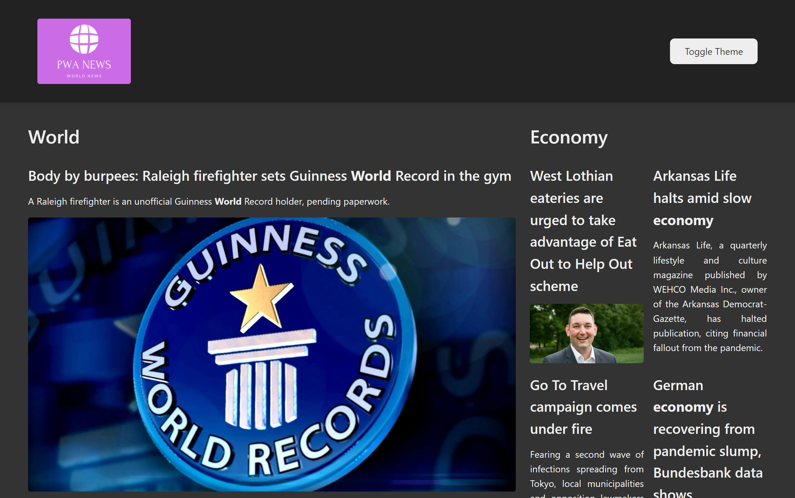

<h1 align="center">
  PWA News
</h1>

  <a href="#-tecnologias">Tecnologias</a>&nbsp;&nbsp;&nbsp;|&nbsp;&nbsp;&nbsp;
  <a href="#-projeto">Projeto</a>&nbsp;&nbsp;&nbsp;|&nbsp;&nbsp;&nbsp;
  <a href="#-funcionalidades">Funcionalidades</a>

 

  

## 🧪 Tecnologias

Esse projeto foi desenvolvido com as seguintes tecnologias:

- [ReactJS](https://reactjs.org/)
- [Styled-Components](https://styled-components.com/)
- [PWA](https://blog.rocketseat.com.br/pwa-o-que-e-quando-utilizar/)

## 💻 Projeto

<h4> Acesse em: https://pwa-news.vercel.app/ </h4>

Este projeto foi feito durante o curso "Criando uma aplicação ReactJS de notícias utilizando PWA", do Bootcamp [LocalizaLabs React Developer](https://web.digitalinnovation.one/track/localizalabs-react-developer), pela plataforma [Digital Innovation One](https://web.digitalinnovation.one/home).

## 💣 Funcionalidades

- Conexão com uma API de notícias.
- PWA: melhorando a performance da aplicação utilizando cache, permitindo também que seja feito o download para desktop e mobile.
- Páginas dinâmicas de posts utilizando react-router-dom.
- Light e Dark theme com styled-components.

---

<h4 align="center"> Feito com ♥ por Marcelino Teixeira </h4>
